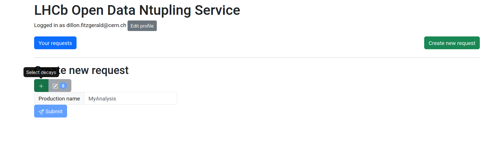
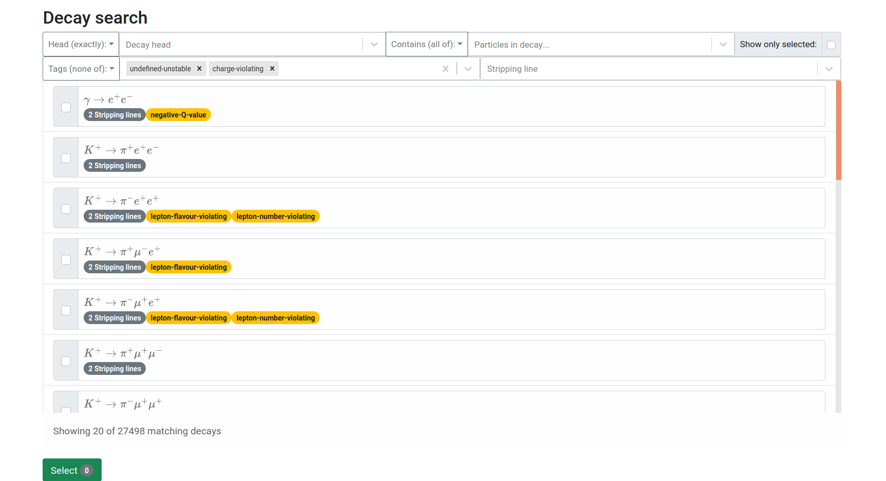
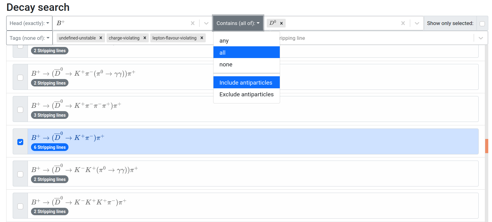

# Selecting Decays

To begin your data query, you should first choose a decay or other physics object to analyze from the list of available selections. This process can be initiated by clicking the green + button, as shown in the figure below.

This will render the list of available decays and other physics objects that can be selected for analysis. Each entry in the list corresponds to an available selection, ordered by the corresponding physics process.  Additional inforamtion is displayed in capsule shaped badges on each list item that the user can mouseover for more details, such as the available "stripping lines" (algorithms used to identify candidates from a particular type of physics process), and "tags" used to identify broader categories of physics processes. An example of this list can be seen below. 

## Filtering Decays

The list of available physics processes is accompanied by many search and filtering functionalities. These come in the form of search fields, many of which have an accompanying drop down menu on the left side to select how the filtering is handled based on the input search fields. In partciular, the list can be filtered by the following:



- **The top level decaying particle:** ***Head***
  - Exact particles or categories of particles can be provided, depending on the drop down menu option.
  - Antiparticles of the input particle can be included or excluded from the filtering procedure depending on the selected drop down menu option. 
- **Particles contained in the decay (multiple inputs accepted):** ***Contains*** 
  - The option to filter by processes containing all of the input particles, any of the input particles, or none of the input particles can be provided based on the selected drop down menu option. 
  - Antiparticles of the input particle can be included or excluded from the filtering procedure depending on the selected drop down menu option.
- **Labels associated with particular list items (multiple inputs accepted):** ***Tags*** 
  - The option to filter by list items corresponding to all of the input tags, any of the input tags, or none of the input tags can be provided based on the selected drop down menu option.
- **Name of stripping line associated with a particular list item:** ***Stripping line***



These filtering options can be seen at the top of the figure below. Notice that the inclusion of antiparticles in *contains* option prooduces selectable items with `$\bar{D}^{0}$` particles. 

List items can be selected by simply clicking them, after which the selected list item will be highlighted, and the corresponding check box will be filled in. Multiple selections can be made from the list, with each selected list item (i.e. physics process) resulting in an Ntuple after the entire procedure is complete. The checkbox at the top right corner can be checked at any time to filter the list to show only physics processes the user has selected, and unchecked to return the list to its previous state. Once all selections are made the green "Select" button at the bottom of the page can be clicked to navigate back to the main page.

TODO!!! LIST THE DEFAULT FILTERING OPTIONS (FOR TAGS). 
