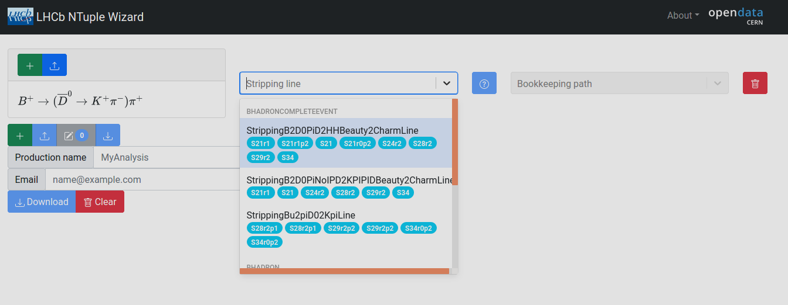
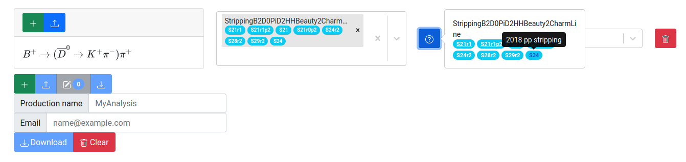

# Choosing a Stripping Line

After selections are made on the Decay Search page, users are routed back to the main page, with each selection now rendered as a row in a table, ultimately corresponding to independent ntuples. An important next step is to choose a *stripping line* that defines a set of selection algorithms applied at LHCb to reconstruct particular physics processes. Details about the LHCb dataflow can be found [here](https://lhcb.github.io/starterkit-lessons/first-analysis-steps/dataflow.html). 



During run time, data passing trigger requiremens are recorded for further analysis and run through the LHCb event reconstruction software. From here, the full set of reconstructed events is filtered by a set of algorithms known as *stripping lines*, resulting in subsets of the full dataset called *streams*. Data streams are generated in various *stripping campaigns*, in which the set of stripping lines corresponding to particular streams are updated. The naming convention for stripping campaings (or stripping versions) is discussed [here](https://lhcb.github.io/starterkit-lessons/first-analysis-steps/dataflow.html). The data streams are what LHCb users and open data users have access to for physics analysis, in particular by choosing a stripping line to identify candidates of a particular physics process.



stripping lines are chosen by interacting with a drop down menu on the row corresponding to your physics process of interest, as shown in the figure below. 

The capsule shaped badges denote the various stripping versions corresponding to a given stripping line. Mouseover tooltips are availalbe for each badge, informing the user about the year the data was taken along with other information about the data flow configuration, when available. Most importantly, if the user wishes to produce Ntuples for a particular physics process with all of the Run II data (2015 - 2018), it is important to choose a stripping line that exists for all of the desired data taking years. 



Cases can arise where stripping line names change over time, and a particular stripping line may not be available for all of the desired data taking years. In these cases, the user can instead look for a related physics process where this is not an issue, or submit multiple queries where different stripping lines are chosen.



Each row in the Ntuple Wizard production configuration table should correspond to data from only one data stream, accessed by choice of stripping line. It is also recommended to choose only one stripping line for each row in the table. After selecting a stripping line, the ? button next to the stripping line drop down menu will be clickable. This will open a menu with a set of links for each stripping version containing the selected line (shown in the figure below). The links guide the user to the LHCb documentation pages with information about the sequence of algorithms and selection criteria applied that define the stripping lines for the different stripping versions. 

TODO!! NEED TO TEST WHAT HAPPENS WHEN TWO STRIPPING LINES ARE CHOSEN ON THE SAME STREAM. MODIFY THIS PARAGRAPH ACCORDINGLY.

