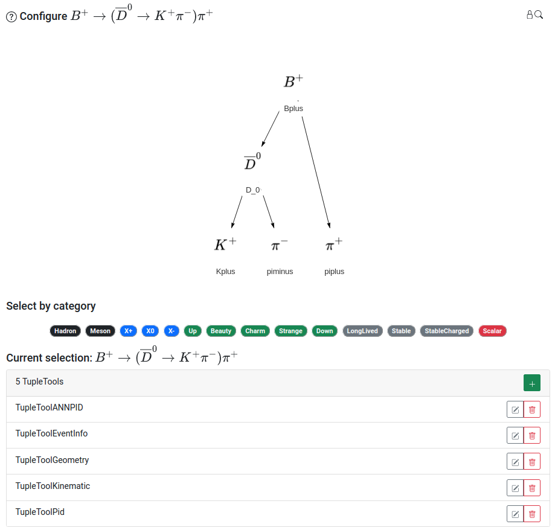
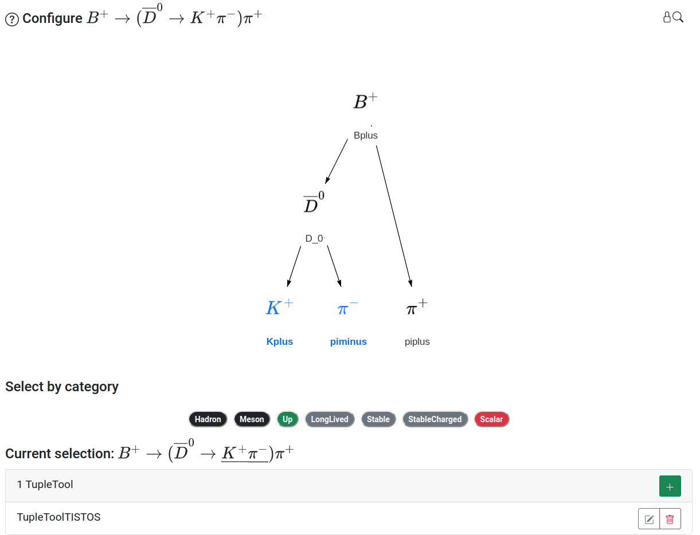

# Configuring the Node Tree

The Ntuple is configured with an interactive node tree that represents the selected physics process, typically a particle decay. The particles in the decay are rendered as nodes in the tree, each of which can be independently configured with the addition of tools, called TupleTools. TupleTools write collections of variables to the output Ntuple, with the set of variables categorized by different TupleTool names. The entire candidate comes with 5 default TupleTools useful for analyzing LHCb data. More information about the default TupleTools, as well as other available tools can be found [here](https://lhcb.github.io/starterkit-lessons/first-analysis-steps/add-tupletools.html). Tools applied to the entire candidate are applied to each node in the tree. The entire candidate can be configured when no particular nodes in the tree are selected. A screenshot of the node tree with the default TupleTools applied to the entire physics process is shown in the figure below.

Nodes can be selected by clicking their location on the graph, at which point the selected nodes will be highlighted in blue. A collection of nodes can be selected in the following ways:
 - Hold CTRL and click on the desired nodes in succession, releasing CTRL once all desired nodes are selected 
 - Hold Shift + click and drag a window to select the desired nodes, then release Shift + click
 - Select a grouping of nodes by choosing a category under the "Select by category" heading, all nodes corresponding to the chosen category will be selected 

Each node, or collection of nodes, will have an associated set of TupleTools. In the screenshot below, TupleToolTISTOS is applied to the decay products of the `$D^{0}$` to obtain information about the trigger decisions (where TISTOS means Trigger Independent of Signal, Trigger On Signal). The procedure for adding and configuring TupleTools is discussed on the next page. 



It can be the case that the same TupleTool is applied to a particular node twice, for example, once on the entire candidate, and once on the individual node. This should be avoided, as it can result in errors in data processing. 



