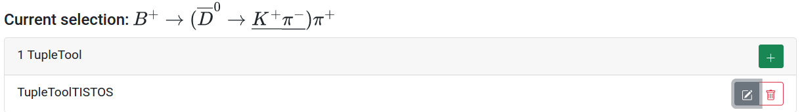
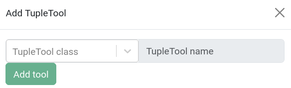
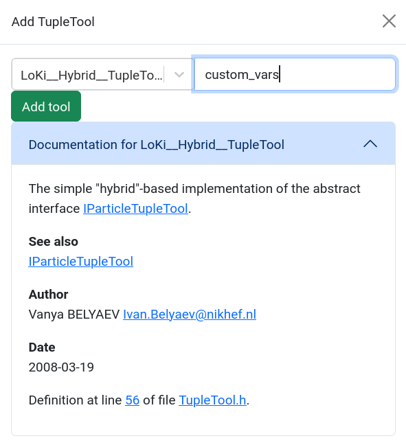
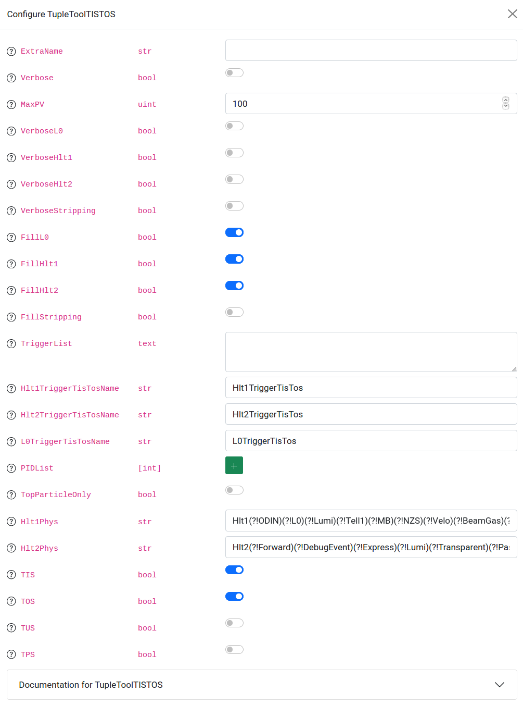
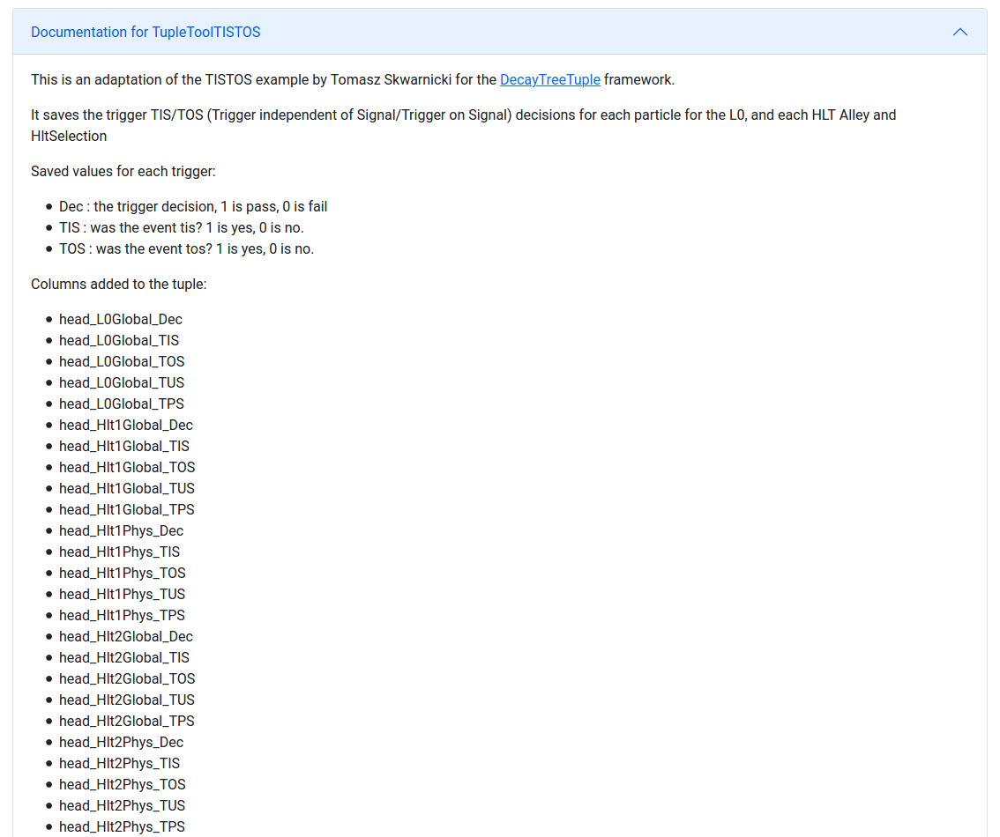
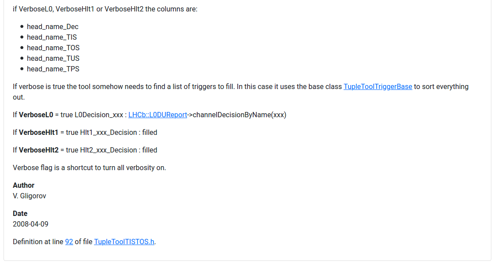
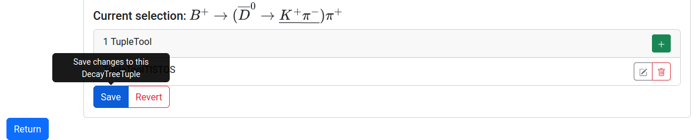

# Tuple Tools

TupleTools can be added to the entire candidate, a particular node, or any collection of nodes by first making a selection on the graph, and then clikcing the green "+" button on the right side of the TupleTool table located below the node tree. Any existing tool can be removed by clicking the red button with a trash can icon corresponding to the particular tool. Similarly, TupleTools can be configured by clicking the edit pad button in the row corresponding to the TupleTool name. Each of these buttons can be seen in the screenshot below.

Clicking the green "+" button will launch a popup containing a drop down menu of available TupleTools, shown in the screenshow below. If the name of the desired TupleTool is known, it can be found by typing it into the search box. 

Once a tool is selected from the drop down menu, a custom name can be given to the tool, and documentation for the tool can be seen in the popup window. The green "Add tool" button must be clicked in order to add the TupleTool onto the selected node(s), as shown below. 

TupleTools are configured with an interactive modal displaying the name, datatype, and input fields for all configurable parameters of the TupleTool. Information about each configurable parameter is displayed as an overlay tooltip when hovering over the circled question marks next to each parameter name, where available. The input field depends on the corresponding datatype. DESCRIBE HOW INPUT LISTS AND DICTIONARIES ARE CONFIGURED! A screenshot of the modal for TupleToolTISTOS is shown below. 

At the bottom of the modal, the same documentation displayed in the "add tool" popup window can be found for the TupleTool in question, including links to the corresponding Doxygen pages where available. 

After adding TupleTools to the node tree, and configuring them as desired, it is important to save the changes you have made on the Ntuple configuration page. This can be done by clicking the blue "Save" button near the bottom of the page.

